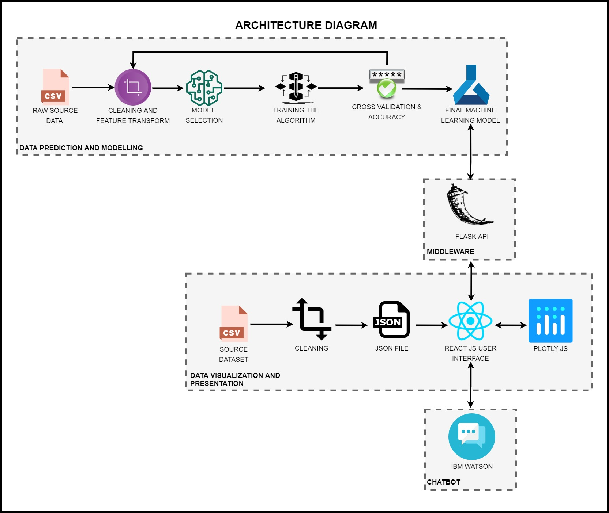
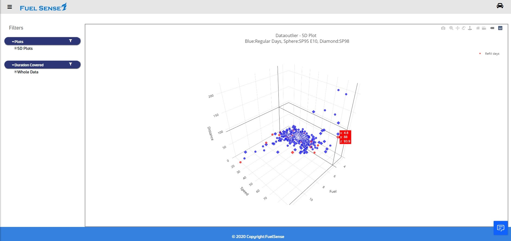
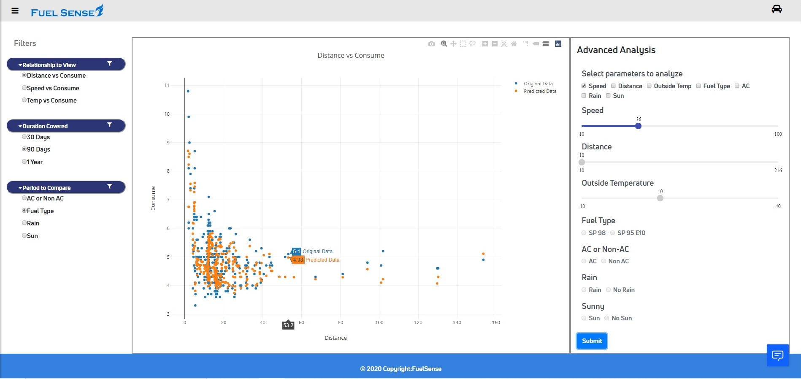
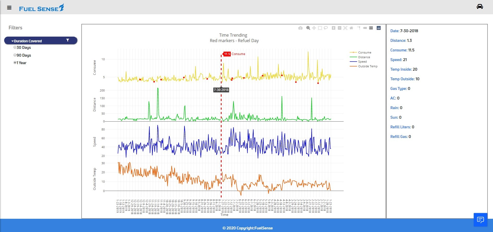
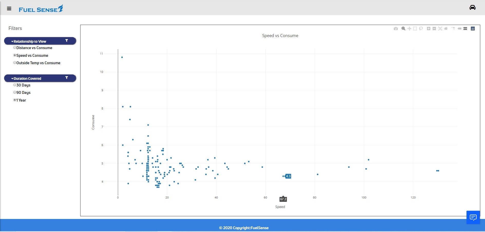
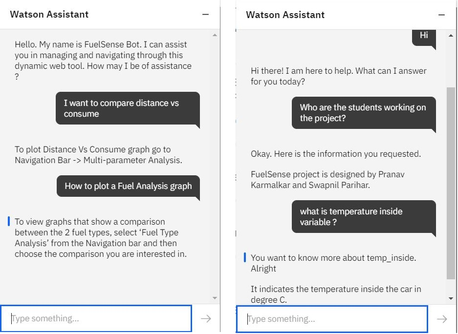
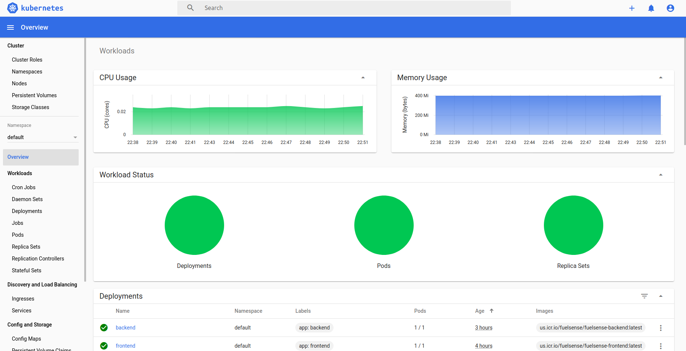

# FuelSense

A regression based fuel economy analysis tool

## Abstract

Modern automotive companies spend large sums of money trying to meet government-regulated standards for fuel-efficiency. Finding optimal conditions for an existing design to be tested under is far cheaper than redesigning an engine for higher efficiency. By creating predictive software capable of estimating the conditions of optimal function, car corporations could save substantial amounts of money on redesigns.

Because accurate predictions need to be made with a relatively small dataset, neural nets were unlikely to be effective for this task. Among various regression algorithms that were tried, Random Forest resulted in providing a highly effective predictive model. Random Forest predictions are relatively fast compared to neural nets and they also work well with inconsistent scatter of the data, so they proved to be highly accurate. Also, due to the sparseness of the given dataset KNN was used for approximating optimal values for missing variables.

The project creates an application that enables automotive manufacturers to analyze mileage for different types of fuels and road conditions. Based on input parameters, the application predicts the mileage for a fuel type in different conditions without the need to perform actual physical testing. The project also aims to study the applications of chatbots as a Web navigation tool.

#### Data Source

https://www.kaggle.com/anderas/car-consume#measurements.csv

## Hill Statement

> _Who: Automotive manufactures_

> _What: To gauge analyze the effect of various environmental factors and road conditions on an automotive engine fuel efficiency_

> _WoW Factor: A manufacturer independent analytical tool working with a small input dataset to determine optimal testing condtion for an automtoive engine_

## Architecture Diagram

## Implementation Snippets

#### 5D View of the Dataset to identify Data-Outliers

#### Advanced Machine Learning analysis User Interface

#### Time trending Analysis User Interface

#### Fuel Type Analysis User Interface

#### IBM Watson Chatbot screenshots

#### Kubernetes Deployment screenshot

## Technology Stack

- Frontend : React, Plotly.js
- Middleware : Python - Flask
- Machine learning : Python - scikit-learn, NumPy, Pandas, PyPI
- Support technologies : IBM Watson Chatbot
- Deployment : IBM Cloud, Docker, Kubernetes

## Team Members

1. Dheeral Bhole
2. Ravindra Javadekar
